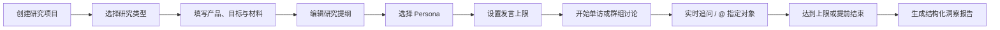
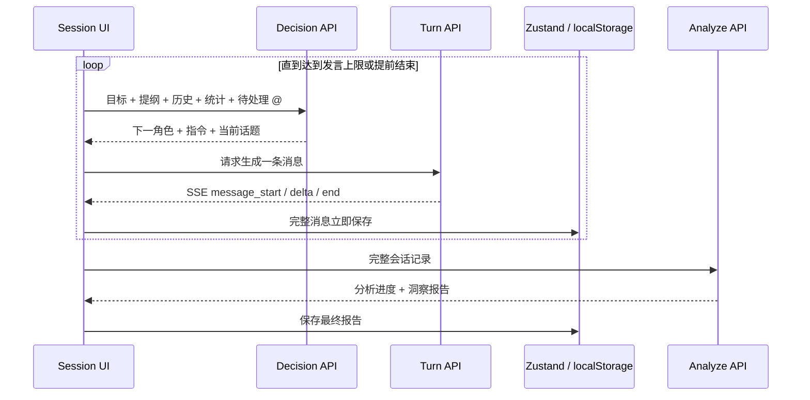

# PersonaLab

一个面向产品经理、用户研究员与设计团队的多 Agent 用户研究平台。PersonaLab 让具有不同背景、动机和决策方式的 Persona Agent 参与深度访谈或群组讨论，研究员可以实时观察、随时追问，并在会话结束后获得结构化洞察报告。

> 当前版本已经从像素游戏式演示重构为高效率的专业研究工作台，产品界面、会话模型与 Agent 编排均为全新设计。

## 产品设计逻辑

PersonaLab 不是让多个模型同时输出一堆答案，而是模拟一场可被主持、可被介入、可被追溯的真实定性研究。

### 1. 研究类型与会话形态分离

产品保留常见的四种研究类型，但底层只维护两种稳定的会话形态：

| 研究类型 | 会话形态 | 参与者要求 | 研究材料 |
| --- | --- | --- | --- |
| 深度访谈 | 单用户对话 | 1 位 Persona | 无强制材料 |
| 焦点小组 | 群组讨论 | 3–6 位 Persona | 可选 |
| 概念测试 | 群组讨论 | 3–6 位 Persona | 1 份必填材料 |
| A/B 对比 | 群组讨论 | 3–6 位 Persona | A、B 两份必填材料 |

这样既保留了用户熟悉的研究方法，也避免为每种方法复制一套会话引擎。

### 2. 用“发言上限”代替机械轮次

发言上限只统计 Persona Agent 的发言，AI 主持人与真人研究员不计入。默认值分别为：

- 深度访谈：10 条
- 焦点小组：20 条
- 概念测试：16 条
- A/B 对比：20 条
- 可配置范围：5–50 条

这让研究长度更可预期，同时不会因为主持人的追问或研究员的临时介入提前消耗额度。

### 3. 串行生成，而不是并发抢话

系统在任何时刻只允许一个 Agent 生成消息。一条发言完整结束并保存后，调度器才决定下一步。这样可以：

- 避免多个 Agent 同时发言
- 让后续角色看见完整上下文
- 支持明确的回复关系与 `@` 提及
- 在单条失败时重试，而不丢失之前的记录
- 让暂停、提前结束和刷新恢复具有清晰边界

### 4. 真人研究员始终拥有最高介入权

研究员可在会话进行时输入问题、使用快捷问题，或 `@` 指定某位参与者。若当前 Agent 正在生成，消息进入 FIFO 高优先级队列；当前发言完成后，研究员消息才显示并立即得到处理。

Agent 也可以在发言中 `@` 另一位 Agent，但连续提及链最多三次，防止对话在少数参与者之间无限循环。真人插问优先于 Agent 互相提及。

### 5. 研究过程与报告可追溯

每条消息都有稳定的序号、说话者、角色、情绪、回复来源和时间戳。最终报告保留完整原始消息，并让原声引用关联到发言者与轮次，而不是生成无法核对的“总结”。

## 核心使用流程



工作台以“研究项目”为组织单位。每个项目保存产品背景、研究目标、研究方法、研究提纲、参与者和材料，方便反复开展研究，而不需要每次从空白开始。

## Agent 架构

### 角色分工

| Agent | 职责 | 是否直接发言 |
| --- | --- | --- |
| Decision Agent | 基于目标、提纲、历史、发言次数与提及关系决定下一步动作 | 否 |
| AI Moderator | 开场、提问、追问、控场、转场，保持问题开放且不诱导 | 是 |
| Persona Agent | 按画像中的行为、价值观、态度和沟通风格表达真实用户观点 | 是 |
| Insight Analyst | 会话结束后提炼共识、争议、关键发现、痛点、原声与建议 | 否 |
| Human Researcher | 随时提问、追问或 `@` 指定参与者，拥有最高调度优先级 | 是 |

### 一次发言的生命周期

旧版本使用一次 SSE 请求跑完整场研究；新版将会话拆为可恢复、可重试的单步循环：



### 调度优先级

Decision Agent 按以下顺序决定下一步：

1. 处理真人研究员排队消息；若存在 `@`，指定对象下一位回应。
2. 处理有效的 Agent `@`；连续提及达到三次后终止提及链。
3. AI 主持人根据提纲追问、转场或重新控场。
4. 在话题相关性基础上选择发言次数较少的 Persona。
5. 除明确追问或 `@` 外，避免同一 Persona 连续发言。

Mock 模式使用确定性规则复现同样的优先级；真实模型模式由调度 Agent 输出结构化决策，并在结果无效时回退到公平性规则。

### Persona Agent 的上下文

每个 Persona 由以下信息构成：

- 基本属性：年龄、性别、职业
- 技术熟练度与决策风格
- 价值观、产品态度和日常行为
- 沟通方式、背景故事与口头表达特征
- 稳定头像色与姓名缩写

Persona Agent 不共享统一答案模板。系统把当前研究目标、产品背景、最近对话、角色画像和本轮任务组合为上下文，使不同参与者能够产生观点差异，并能回应其他人的具体发言。

## 会话状态与容错

会话状态为：

```text
ready → running ⇄ paused → analyzing → completed
                   ↘ error → retry
```

- 每条完整消息立即写入本地存储
- 刷新进行中的会话后恢复为暂停状态
- 暂停在当前消息边界生效
- 提前结束不再调度新发言，并基于已有记录生成报告
- 单条发言失败时保留全部已完成消息，可直接重试
- 使用 `AbortController` 取消当前请求
- 任何时刻最多存在一个 Agent SSE 流

## 接口设计

| 接口 | 作用 | 返回方式 |
| --- | --- | --- |
| `POST /api/simulate/decision` | 决定下一步动作、说话者、指令与话题 | JSON |
| `POST /api/simulate/turn` | 生成一条主持人或 Persona 消息 | SSE |
| `POST /api/simulate/analyze` | 基于完整记录生成洞察报告 | SSE |
| `POST /api/outline/generate` | 根据研究目标生成讨论提纲 | JSON |
| `POST /api/personas/generate` | 根据产品背景生成人格画像 | JSON |
| `POST /api/llm/test` | 测试 OpenAI 兼容接口 | JSON |

主要 SSE 事件：

```text
message_start | message_delta | message_end
analysis_progress | complete | error
```

## 洞察报告

会话达到发言上限或被研究员提前结束后，Insight Analyst 生成轻量卡片式报告：

- 研究摘要
- 共识与争议
- 分级关键发现
- 产品建议
- 代表性原声
- 情绪趋势
- Persona 立场对比
- 痛点影响度与出现频率
- 完整原始会话记录

## UI 设计原则

新版界面采用明亮、克制的产品工具风格：

- 暖白背景、系统无衬线字体和大留白
- 细边框、柔和阴影与轻微半透明层次
- 克制蓝色作为唯一主强调色
- 群聊式消息流：Agent 在左，真人研究员在右
- 桌面端固定参与者面板，移动端转换为抽屉
- 只保留一个流式输入状态，不使用舞台动画或速度倍率
- Persona 使用稳定柔和色头像与姓名缩写，不依赖像素素材

## 数据与隐私

当前版本不包含账户系统或数据库，以下内容由 Zustand Persist 保存到浏览器 `localStorage`：

- 研究项目与研究配置
- Persona 用户画像
- 会话消息与研究状态
- 洞察报告
- LLM 接口配置

API Key 保存在当前浏览器中。发起研究时，前端把本次请求所需的 LLM 配置发送给同源 Next.js Route Handler，再由服务端请求用户配置的 OpenAI 兼容接口；PersonaLab 不将 Key 或研究数据写入服务端数据库。生产部署时仍建议使用受控环境，并在使用第三方模型前确认其数据政策。

## Mock 模式

未配置 API Key 时自动启用 Mock 模式，无需外部模型即可完整体验：

- 四种研究类型与两种会话形态
- AI 主持人与 Persona 串行发言
- 真人插问与 `@` 指定对象
- Agent 互相提及
- 暂停、继续、提前结束与刷新恢复
- 报告生成与历史记录

Mock 模式不仅用于演示，也用于本地开发和端到端流程验证。

## 技术栈

- Next.js 16（App Router）
- React 19
- TypeScript 5（strict）
- Tailwind CSS 4
- Zustand 5 + Persist
- Recharts
- SSE + ReadableStream
- OpenAI-compatible Chat Completions API

## 本地启动

环境要求：Node.js 20+、pnpm 9+。

```bash
pnpm install
pnpm dev
```

默认访问：<http://localhost:5000>

指定端口：

```bash
DEPLOY_RUN_PORT=5001 pnpm dev
```

进入“设置”页面可填写真实 LLM 配置；不填写 API Key 即使用 Mock 模式。

## 生产模式

生产模式会先完成类型检查与优化构建，再启动稳定的 Next.js 服务，不包含开发热更新和调试开销。

```bash
pnpm build
PORT=3000 pnpm start
```

## 项目结构

```text
src/
├── app/
│   ├── (app)/
│   │   ├── lab/          # 研究工作台
│   │   ├── session/      # 单访 / 群组会话
│   │   ├── personas/     # 用户画像
│   │   ├── insights/     # 研究记录与洞察
│   │   └── settings/     # LLM 与本地数据设置
│   └── api/
│       ├── simulate/
│       │   ├── decision/ # 单步调度
│       │   ├── turn/     # 单条消息流式生成
│       │   └── analyze/  # 最终分析
│       ├── outline/      # 提纲生成
│       ├── personas/     # Persona 生成
│       └── llm/test/     # 模型连接测试
├── components/           # 导航、头像等共享组件
└── lib/
    ├── llm/
    │   ├── llm.ts       # OpenAI 兼容调用与流解析
    │   └── session.ts   # 调度辅助、Mock 与报告逻辑
    ├── types.ts         # 研究、消息、报告等核心类型
    ├── store.ts         # Zustand 本地状态与迁移
    └── default-personas.ts
```

## 开发检查

```bash
pnpm ts-check      # TypeScript strict 检查
pnpm lint:build    # ESLint
pnpm lint:style    # Stylelint
pnpm build         # 生产构建
```

## 当前边界

- 仅提供明亮主题
- localStorage 是唯一持久层，不支持跨设备同步
- 不包含账户、权限或多人协同编辑
- LLM 输出质量取决于所配置模型对 JSON 与流式输出的兼容程度
